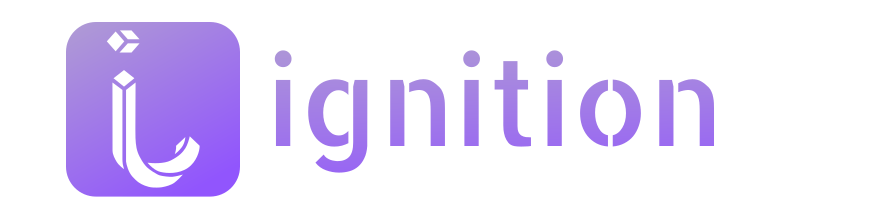
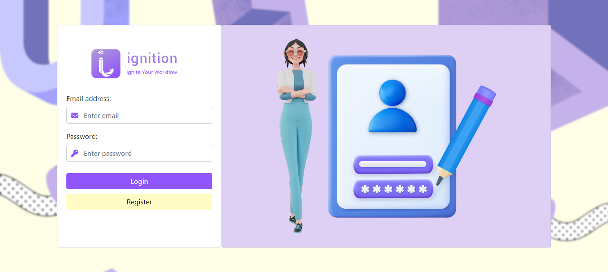
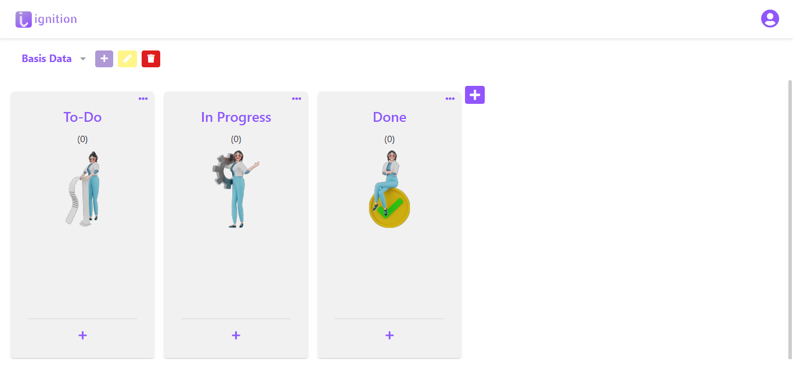
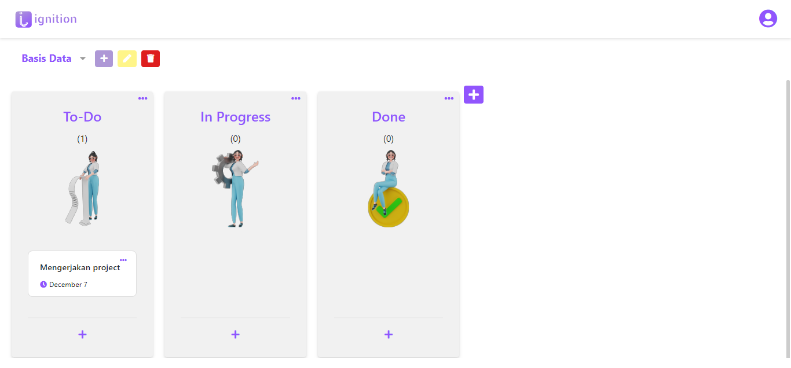

# Ignition Kanbant App
Kanban Board project built with MEVN Stack (MongoDB, Express, Vue, Node.js)

## Table Of Contents
- [Ignition Kanbant App](#ignition-kanbant-app)

    - [Table Of Contents](#table-of-contents)
    - [Author](#author)
- [Documentation](#documentation)

    - [How To Run?](#how-to-run)
    - [Screenshots](#screenshots)
    - [Notes](#notes)
- [Contact](#contact)

## Author

- [@nadiaalnd](https://github.com/nadiaalnd)

# Documentation

## How To Run?

- Open Terminal or Command Prompt
- Clone this repository
    ```sh
    git clone https://github.com/nadiaalnd/Iginition-kanbant-apps
    cd Iginition-kanbant-apps
    ```
- Install dependencies and run app server
    ```sh
    yarn install
    yarn dev
    ```
- Install dependencies & serve frontend
    ```sh
    cd ./client/
    yarn install
    yarn serve
    ```
- Open the localhost link below to view the running application
    - [Localhost](http://localhost:8080/)


## Screenshots

- Login 
- Dashboard 
- Task 

## Notes

- Ensure you have node.js installed on your system to run this application.
- If you want to use external MongoDB database, change config file (.config.js) and change its content like below.
  > ```
  > MONGO_DB_URI: process.env.MONGO_DB_URI || '<YOUR-MONGO-DB-URI>'
  > ```

---

## Contact

- Nadila Aulya Salsabila Mirdianti
- Email : nadila2244@gmail.com
- Instagram : [@nadiaalnd](https://instagram.com/nadiaalnd)
